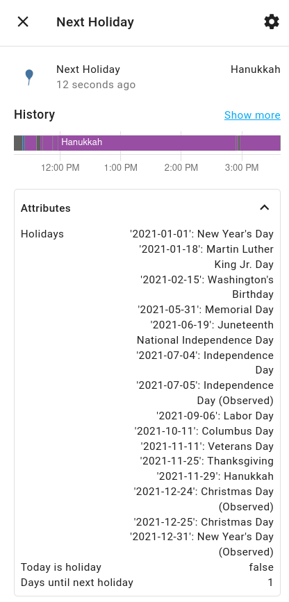

# Next Holiday Sensor

This sensor tells you what holiday is coming up next. You can use it to set holiday light
colors or other scenes. 

The state of the sensor tells you what the upcoming holiday is. If today is a holiday, the
state will be that holiday. There are sensor attributes showing all the holidays for the
year, whether or not today is a holiday, and how many days there are before the next
holiday. The component will look ahead into the next year for the next holiday.

Holidays are recomputed every year. In the config you can specify what holidays you want
to track. The holidays and config are based on the
https://github.com/dr-prodigy/python-holidays

## Configuration

Configuration is set as a sensor of the `next_holiday` platform.  You make a list of
`sources`, each of which can have the following attributes:

| Attribute   | Type  |  Description | Example|
| --- | --- | --- | --- |
| country| str | A country to load holidays from | `'USA'`
| state | str | A state within the country for state holidays | `'WA'`
| province | str | A province within the country for state holidays | `'ON'` 
| multiday | bool | If true (default), holidays that span multiple days will be shown mulitiple times. Otherwise, only the first day will be shown| `true` 
| observed | bool | If true (default), observed holidays will be included in addition to real ones| `true` 
| filter | list of str | A filter where only holidays matching the query will be added| [See below] 
| kwargs | dict | A dict of key/value pairs that will be passed on to the underlying library. This can be used to activate special behavior for certain countries (like turning off Sundays for Norway)| [See below] 

Multiple country/state/provinces and filters may be combined to get a pretty flexible
list of holidays.

Lists of valid states and province abbreviations can be found 
in the underlying library, e.g. [here for
Canada](https://github.com/dr-prodigy/python-holidays/blob/master/holidays/countries/canada.py)

### Example

Add a sensor to your configuration along the lines of:

    sensor:
      - platform: next_holiday
        sources: 
         - country: "USA"
           state: "WA"
         - country: "Israel"
           multiday: false
           filter:
             - 'hanukkah'
         - country: "Norway"
           kwargs:
             include_sundays: false

This loads all normal holidays for the US State of Washington and also
throws in Hanukkah by loading the Israel holidays and filtering everything
but Hanukkah out.

Norwegian holidays are added as well. But because Norway considers every Sunday
a holiday, we pass the special `include_holidays` flag down to the underlying 
library to avoid tracking them.
